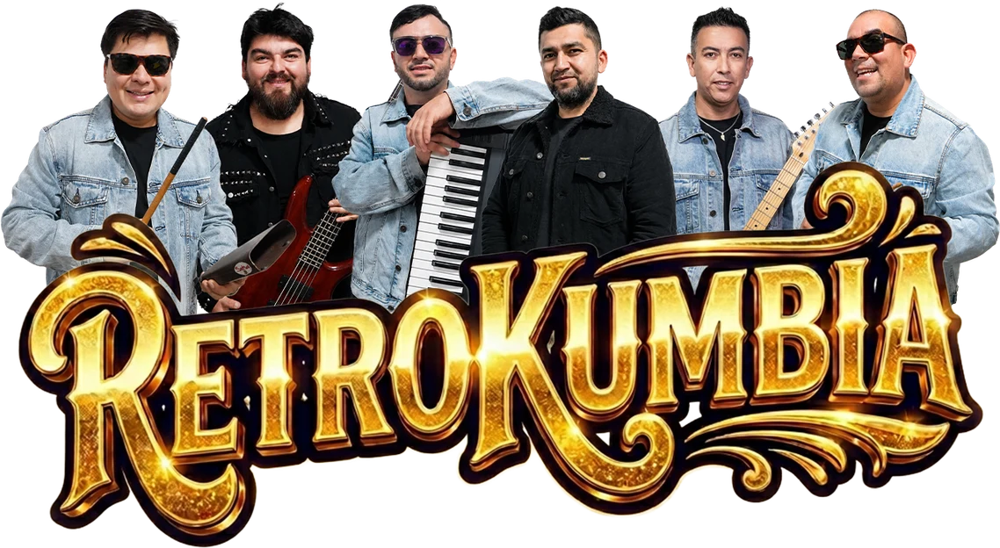

<p align="center">
  
</p>

<h1 align="center">RetroKumbia · Sitio web oficial</h1>

<p align="center">
  Los éxitos de la movida tropical chilena y argentina de los 90 y 2000, en vivo.<br>
  Banda de cumbia desde Lebu, Chile.
</p>

<p align="center">
  <a href="https://retrokumbia.netlify.app"><strong>🌐 Ver el sitio</strong></a> ·
  <a href="https://www.youtube.com/@RetroKumbia_oficial">YouTube</a> ·
  <a href="https://www.instagram.com/retrokumbia_oficial/">Instagram</a> ·
  <a href="https://www.tiktok.com/@la.retro.kumbia">TikTok</a>
</p>

---

## Sobre el proyecto

Sitio de una sola página para presentar a la banda y facilitar su contratación. El contenido sale del dossier musical 2026 de la banda: presentación, integrantes, servicios, ficha técnica, requerimientos, galería y contacto.

Está hecho con **HTML, CSS y JavaScript puro**, en un solo archivo (`index.html`). No usa frameworks ni pasos de compilación, así que se puede abrir o publicar tal cual.

## Qué incluye

| Sección | Contenido |
| --- | --- |
| **Portada** | Logo con efecto 3D que sigue al mouse y foto de fondo con parallax |
| **Quiénes somos** | Presentación de la banda y tipos de eventos |
| **La banda** | Los 6 integrantes con su instrumento |
| **Videos** | Videoclip oficial *De los besos que te di* y dos videos en vivo, reproducibles dentro de la página |
| **Servicios** | Qué incluye el show y duración referencial (60 minutos) |
| **Rider** | Camarín, catering y **ficha técnica con escenario 3D interactivo** |
| **Galería** | Carrusel 3D que gira con el scroll y visor de fotos ampliadas |
| **Contacto** | WhatsApp con mensaje listo, teléfono y correo |

### Escenario 3D (ficha técnica)

Plano de escenario interactivo, hecho solo con CSS 3D:

- Tarima, truss con luces, pantalla LED, PA, instrumentos y monitores de piso
- 6 posiciones: teclados, batería, percusión, bajo, voz principal y guitarra
- Al seleccionar una posición se ilumina y se muestran sus canales, su mezcla de monitoreo y si necesita 230 V
- Vistas *Público*, *Aérea*, *Lateral* y *360°*, zoom y giro con arrastre
- Conectado con la lista de canales (21 entradas) y las 7 mezclas de monitoreo

### Detalles técnicos

- Efectos 3D ligados al scroll y al mouse, sin librerías
- Respeta la preferencia del sistema de **reducir movimiento**
- Los videos de YouTube cargan el reproductor solo al hacer clic (`youtube-nocookie.com`), así la página carga rápido
- Imágenes en formato WebP optimizado
- Diseño adaptado a celular, tablet y escritorio

## Estructura

```
.
├── index.html      # Todo el sitio: estructura, estilos y scripts
├── img/            # Logo, fotos de la banda y galería (WebP)
├── netlify.toml    # Configuración de publicación y caché de imágenes
└── README.md
```

## Ver en local

No necesita instalar nada. Desde la carpeta del proyecto:

```bash
python -m http.server 5173
```

Luego abre <http://localhost:5173>.

## Publicación

El sitio está publicado en **Netlify**: <https://retrokumbia.netlify.app>

Para publicar cambios con [Netlify CLI](https://docs.netlify.com/cli/get-started/):

```bash
netlify deploy --prod --dir .
```

## Cómo editar el contenido

Todo está en `index.html`. Busca estos textos para ubicar cada parte:

| Quiero cambiar… | Busca |
| --- | --- |
| Integrantes | `<!-- BANDA -->` |
| Videos de YouTube | `data-yt="` (es el ID del video) |
| Servicios y duración | `<!-- SERVICIOS -->` |
| Camarín, catering y lista de canales | `<!-- RIDER -->` |
| Posiciones del escenario 3D | `const STATIONS` |
| Fotos de la galería | `<!-- GALERÍA -->` |
| Teléfono, WhatsApp y correo | `<!-- CONTACTO -->` y `wa.me/` |

> Si cambias la lista de canales, revisa que el atributo `data-st` de cada fila coincida con el `id` de su posición en `STATIONS`. Así el escenario 3D sabe qué canales mostrar.

## Contacto y contrataciones

**Representación artística oficial · Grupo RetroKumbia Manager**

- 📞 [+56 9 5402 1040](tel:+56954021040) · [WhatsApp](https://wa.me/56954021040)
- ✉️ [manager.retrokumbia@gmail.com](mailto:manager.retrokumbia@gmail.com)

---

<p align="center">© 2026 RetroKumbia · Lebu, Chile</p>
